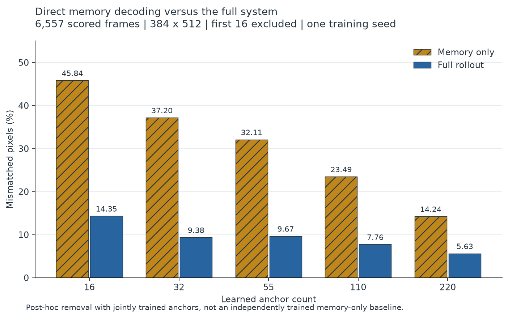
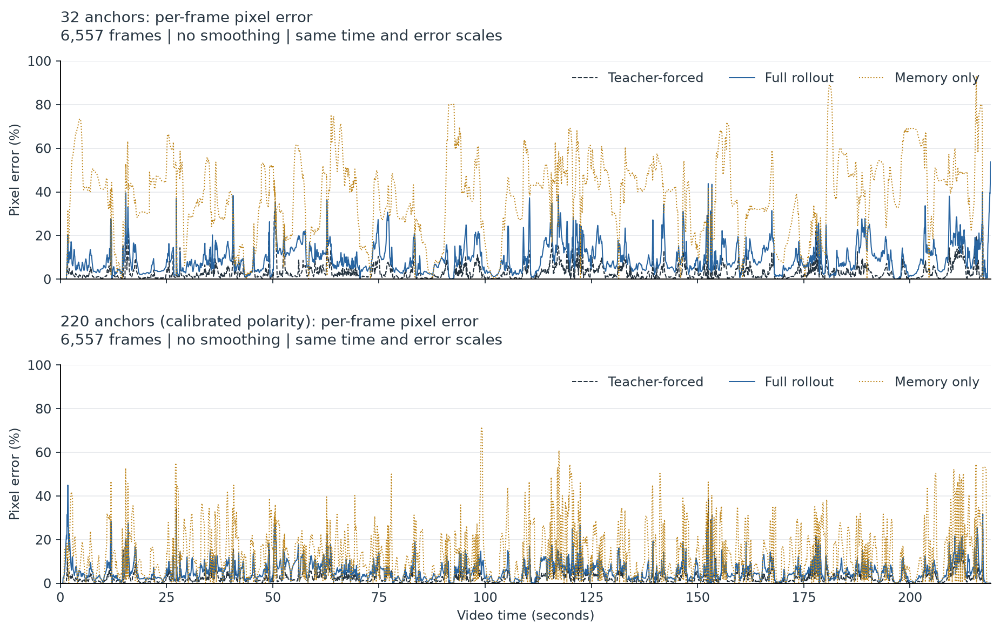

# Neural Network Dreams of Bad Apple

I started this project for a very serious reason: making Bad Apple out of things is cool, and I wanted to make my own.

The idea was to turn neural network activations into the video. Then it became something a little more interesting to me: give the model a short beginning, take the source away, and let it keep going from its own predictions. I wanted to see what happened when it made a mistake, then had to live with that mistake.

The final version can reconstruct the full sequence with 5.63% average pixel error after its initial warmup. It needs learned scene memories to stay on track, though. That led to the question I ended up caring about most: **is the prediction model doing useful work, or have I just built an expensive way to play back memories?**

[Watch the source beside the final model, 45–60 seconds](videos/hero_45_60.mp4) · [Watch the full video](videos/hero_source_vs_220_full.mp4)

The clips are silent. “Dreaming” is just my name for the free-running prediction loop, not a claim about what the network experiences.

## First, just get fifteen seconds working

My first target was the 45–60 second section. Fifteen seconds felt like a reasonable place to start before committing to the whole video.

The original idea involved attention maps. During the project I found [Valérien Braye's Bad Apple in GPT-2 XL attention maps](https://brayevalerien.com/blog/bad-apple-but-its-gpt2/), which optimizes input embeddings while keeping GPT-2 frozen. The [Reddit discussion](https://www.reddit.com/r/LocalLLaMA/comments/1r5lra1/bad_apple_but_its_gpt2_xl_attention_maps/) also suggested generating each frame from the previous one. That was the direction I wanted to explore.

My implementation took a different route: a small autoencoder and a model that predicts what comes next in its latent space. It does not use GPT-2, and the finished video is not an attention-map visualization.

The autoencoder has two parts. The encoder turns a frame into a smaller spatial representation, or *latent*. The decoder turns that representation back into an image. At the final working resolution, the shapes are:

~~~text
384 × 512 binary frame
          ↓ encoder
64 × 24 × 32 latent grid
          ↓ decoder
384 × 512 output probabilities
          ↓ threshold at 0.5
black-and-white frame
~~~

Each output pixel really is a thresholded neural activation. But it is a decoder output, not a claim that an arbitrary hidden neuron spontaneously learned to draw a particular pixel.

One naming detail matters: the saved autoencoder is called `basic_full`, but “full” meant full resolution. It was trained on the fifteen-second prototype, then reused frozen for the longer video. The later predictors were trained on the full sequence.

I tried a spatial attention gate in the autoencoder too. It didn't make a meaningful difference in the early comparison, so the plain autoencoder became the default. I kept the attention version as a replaceable experiment.

That became a useful rule for the project: keep extraction, reconstruction, prediction, and rendering separate. I wanted to be able to change an idea without rebuilding everything around it.

[See what the autoencoder alone reconstructs](videos/autoencoder_45_60.mp4). This version receives the source on every frame; it is a reconstruction check, not a prediction experiment.

## Taking away the answers

Once the autoencoder worked, I froze it and trained a second network to predict the next latent.

The final setup uses a rolling history of 16 latent frames. In free rollout, the model receives 16 real frames at the beginning. Frame 15 is at 0.5 seconds; frame 16, at about 0.533 seconds, is the first generated frame. After that, predictions go back into the history.

It never gets another source frame. The full video's first 16 frames are actually all black, so that warmup isn't a rich visual prompt. The learned weights, scene memories, and clock have to carry the sequence.

That last condition is where things get difficult. A model can be good at predicting the next frame when its starting point is correct, and much worse when its starting point is something it invented.

I kept two views of the **same checkpoint**:

- **Teacher-forced:** every prediction starts from the correct source history.
- **Free rollout:** after warmup, every prediction starts from the model's own recent outputs.

There isn't a separate, stronger “teacher model” here. The weights are the same. What changes is the history they receive.

The gap between these views became more useful than training loss alone. In the final zero-anchor control, teacher-forced pixel error was 3.17%. Free-rollout error was 44.82%. That's a fairly blunt demonstration of how little a good one-step result can tell you about a long sequence.

[Watch the zero-anchor comparison](videos/collapse_zero_45_60.mp4): source is upper left, teacher-forced upper right, and free rollout lower left.

## Bad Apple is not just smooth motion

At first I thought the main problem would be accumulating small errors: a hand shifts slightly, the next prediction starts from the shifted hand, and eventually the whole silhouette drifts.

That does happen. But Bad Apple also changes scenes, characters, scale, and black/white polarity. Some transitions are not something you can reliably infer from a short local motion history.

I also noticed the opposite problem. Sometimes the overall silhouette barely changed, but hands or wings were moving and the model missed those movements. A stable-looking body could hide a poor motion prediction.

So the model needed help with two different jobs: following local changes, and staying somewhere near the right scene over a much longer timeline.

### A U-Net that shrinks time

The first autoregressive model used a ConvGRU. The later version replaced it with a temporal U-Net.

The word *temporal* matters here. This U-Net reduces the **time dimension**, not the spatial size of the latent grid:

~~~text
Last 16 latent grids + differences between adjacent grids
                         ↓
              concatenate along channels
                         ↓
                  16 time steps ──────────────────┐
                         ↓                        │
                   8 time steps ───────┐          │
                         ↓             │          │
                   4 time steps        │          │
                         ↓             │          │
                   8 time steps ← concatenate skip │
                         ↓                        │
                  16 time steps ← concatenate skip
                         ↓
               features at the final time step
                         ↓
          slow velocity + masked fast velocity
~~~

The spatial grid stays at 24 × 32. The convolutions process space and time, and the skip connections preserve higher-temporal-resolution features on the way back up. Everything in the input window is already in the past, so predicting its next frame is still causal.

Instead of predicting a completely new latent, the motion path predicts a change:

```text
motion candidate = previous predicted latent
                 + slow velocity
                 + mask × fast velocity
```

Here, the motion candidate starts from the previous predicted latent, and the mask is learned across the spatial grid. The slow branch makes bounded adjustments; the masked fast branch has more room for larger local changes.

Those are learned latent changes, not optical-flow vectors moving pixels around. The distinction matters when interpreting what the model has learned.

### Giving it memories, without resetting the video

For longer-term structure, I added *anchors*: learned latent grids associated with fixed times in the video. Their values start from selected encoded source frames, then become trainable parameters. The times are selected to cover the timeline and important changes; they are not trainable.

At each step, the model blends the two nearest anchors in time:

```text
memory(t) = sum(address weightᵢ(t) × learned anchorᵢ)
sum(address weights) = 1
```

The weights depend on temporal distance. This is a small, time-addressed memory, not a search over arbitrary image content.

The model then blends that memory with its motion candidate:

```text
next latent = motion candidate + gate × (memory − motion candidate)
```

The gate varies across the spatial grid. Moving areas can receive less ordinary memory correction, while a separate transition gate can allow stronger correction near a scene change.

This was an artistic choice too. I wanted the next scene to bleed into the prediction, with the model's mistakes still visible. I didn't want periodic replacements with a clean source frame.

Time goes into the temporal network as well as the memory addressing. It tells the model where it is in this particular video. There is no audio input.

This is also where the project stops being “predict an unknown future from half a second of video.” The model has been trained on the whole sequence and carries information about it in its weights and anchors. The interesting part is how it uses that information while running on its own.

## Fifteen seconds working did not mean three minutes would work

Moving to the full 219.1-second sequence exposed failures that the short prototype hadn't prepared me for.

The long-horizon version changed both the model and its training. Time features were based on seconds so their periods didn't stretch with the video length. Memory blending was scaled to anchor spacing. The transition gate could increase correction beyond the normal cap.

Training also started exposing the model to its own imperfect history:

1. Start with a real latent window, with a little noise.
2. Let the model run freely for a randomly selected burn-in of up to 128 frames.
3. Train on the following predicted steps, with the supervised rollout growing from 4 to 32 frames.

The burn-in does not keep a gradient graph. During the supervised rollout, backpropagation is truncated every four steps. That keeps memory use manageable, but it also means this is **not** end-to-end backpropagation through the entire video.

The anchors stay frozen for the first six epochs, then become trainable. The intention was to make the prediction path learn to work with a stable memory before letting both change together.

The objective combines latent reconstruction error, slow and fast velocity supervision, extra emphasis on changing regions, and losses for the masks, transition gate, and polarity. It also keeps anchors near their initial reference latents.

I wouldn't claim each of those changes has been independently proven necessary. Several changed together. What I can say is that training only on clean starts was a poor match for the way I wanted to run the model.

## A mistake I found especially interesting

A later recovery experiment exposed a conflict in the velocity target.

Suppose the real previous state is 5, and the next state should be 6. The true motion is +1.

But what if the model has already drifted to 3?

Telling it to reproduce +1 gets it to 4. That's the correct motion from the wrong starting point. It needs +3 to recover.

In symbols, those are different targets:

```text
scene motion    = true next state − true previous state
recovery motion = true next state − predicted previous state
```

The latent reconstruction loss wanted the model to reach the correct state. Meanwhile, the original velocity losses rewarded the change between two *true* states. In teacher forcing, those goals agree. Once the model drifts, they can pull in different directions.

Memory fusion adds another detail. Treating the current memory and gate as fixed, the velocity needed before fusion is:

```text
recovery velocity = (true state − gate × memory) / (1 − gate)
                    − predicted previous state
```

The division is elementwise. The recovery fine-tune used that state-relative target, while retaining a smaller true-scene-motion objective. Only the later temporal decoding blocks and motion heads were trained; memory and polarity stayed frozen.

It helped, but it wasn't a magic repair. In that separate run, full-rollout latent MSE improved from about 0.3375 to 0.3268. A second epoch lowered training loss but slightly worsened the rollout result.

That was a useful lesson on its own: **learning the right motion and learning how to recover are not quite the same task.**

This recovery fine-tune was a separate experiment. The anchor-budget results below use the matched long-horizon training recipe, not a mixture of recovery-fine-tuned and original checkpoints.

## Then I looked at the parameter count

A single anchor contains:

```text
64 × 24 × 32 = 49,152
```

learned values.

With 220 anchors, that's 10,813,440 parameters just for memory.

| Component in the 220-anchor system | Parameters |
| --- | ---: |
| Frozen autoencoder | 167,665 |
| Temporal U-Net | 116,256 |
| Time features, output heads, and gates | 16,934 |
| Anchor values | 10,813,440 |
| Predictor total, excluding autoencoder | 10,946,630 |

About 98.8% of the predictor's parameters are anchor values. The temporal U-Net itself is small.

There are 6,573 video frames, and the 220 anchors have an average interval of roughly one second. They are not evenly spaced: some parts of the video get more anchors than others.

But “only 220 anchors” is not a reason to dismiss the amount of stored information. Each anchor is a large tensor. And a modest correction applied repeatedly can strongly influence a rollout. A gate below one does not make memory unimportant.

At this point I was honestly wondering whether I had spent a lot of compute rediscovering something obvious: predictions drift, memories help, and adding more memories makes reconstruction easier.

So I tried removing the prediction machinery.

## Is this just memory playback?

The comparison was deliberately simple. Take the anchors from an already trained model, keep the same time-based addressing, polarity handling, and frozen decoder, and decode the blended memory directly.

~~~text
Full system:
history + time → motion prediction → blend with memory → decoder

Memory only:
time → blend the same learned anchors → decoder
~~~

This is a **post-hoc removal experiment**, not a separately trained memory-only competitor. The anchors were learned as part of the full system; another model trained specifically for direct playback might do better. Removing several parts at once also cannot tell us how much of the difference comes from history, the U-Net, or the gates.

Still, it answers a useful, narrower question: does directly decoding these memories reproduce what the full system does?

### What I measured

All results below use the full sequence at 30 fps and 384 × 512 resolution. Scores exclude the first 16 frames, leaving 6,557 scored frames. Pixel error is the fraction of binary pixels that disagree with the source, averaged across those frames. Lower is better.

The budget runs use the same main settings: batch size 16, learning rate 0.0003, 12 epochs, and seed 7. They share the frozen autoencoder and polarity-calibration procedure. The zero-anchor control has no anchor regularization because it has no anchors; it still receives time input.

| Anchors | Teacher error | Full-rollout error | Memory-only error |
| --- | ---: | ---: | ---: |
| 0 | 3.17% | 44.82% | — |
| 16 | 3.21% | 14.35% | 45.84% |
| 32 | 3.27% | 9.38% | 37.20% |
| 55 | 3.20% | 9.67% | 32.11% |
| 110 | 3.14% | 7.76% | 23.49% |
| 220 | 3.13% | 5.63% | 14.24% |

[Exact quality results](tables/01_quality.csv) · [Exact memory-only comparison](tables/02_memory_only.csv)

Teacher-forced error barely changes across these budgets. Free rollout changes a lot. That suggests the bigger difference is in staying on track without correct history, rather than ordinary one-step reconstruction quality.

It is not perfectly monotonic: 55 anchors has slightly worse pixel error than 32. There is only one training seed per budget, so I would not turn that small reversal into a general rule about the best anchor count.

The direct-memory comparison is clearer. At every nonzero budget tested, the full system has lower average pixel error than decoding the same memories alone. The gold bars below are memory-only outputs; the blue bars are full rollouts. This shows the effect of removing the prediction and fusion machinery together, not the isolated value of any one component.



With 32 anchors, error falls from 37.20% to 9.38%, a 74.8% relative reduction. With 220, it falls from 14.24% to 5.63%, a 60.4% reduction. Those percentages are reductions in *error*, not percentage-point gains in accuracy.

So the full system is not equivalent to directly playing back its anchor interpolation. That was reassuring. It doesn't prove the model understands motion, or rule out a more sophisticated time-conditioned interpolation explanation.

[Watch the 32-anchor comparison](videos/memory_32_45_60.mp4) · [Watch the 220-anchor comparison](videos/memory_220_45_60.mp4)

The averages also hide difficult moments. Below are the unsmoothed per-frame errors for 32 and 220 anchors, on the same scales. More memory helps overall, but transitions and local failures still produce spikes. A good average is not the same as a clean silhouette on every frame.



The clips use the original 45–60 second prototype interval, not an interval chosen for the best score. [The full budget montage is available too](videos/anchor_budget_full.mp4).


## What I would try next

The next experiment I'd care about is a memory-only model trained specifically for that job, with its own optimized anchors. That would be a stronger comparison than removing pieces after joint training.

I'd also test what happens when the full model's history is frozen or shuffled while its time input stays correct. That would help distinguish useful temporal dependence from a model mostly following its learned timeline. It would still need careful interpretation, because corrupted history is a different input distribution.

And before spending much more on model size, I'd repeat selected budgets with more seeds and look more closely at contour quality and difficult transitions. Pixel error can be forgiving when most of a frame is empty background. The broad shape can look fine while fingers, wings, or edges are still wrong.

None of those follow-ups has been run as part of the results in this post.

## Was it worth it?

I don't think this project discovered a new principle of machine learning. Errors accumulating in a feedback loop is not new. Neither is using stored information to make reconstruction easier.

But I understand those ideas differently after watching them happen in something I built.

The useful part was learning to separate questions that initially looked like the same question: can the decoder draw the shape, can the predictor follow its motion, can it recover from its own state, and is the displayed error even coming from the shape model?

The project still needs a lot of memory. It still produces rough edges and misses movements. It is reconstruction of one known video, with explicit time input and no held-out-video evaluation. I wouldn't present it as a general video generator or an efficient video codec.

I would present it as a small experiment that started with a fun visual idea and gave me a few better questions to ask.

Also, it plays Bad Apple. That was the original plan.

---

The music and shadow-art animation are not my work. “Bad Apple!! feat. nomico” was arranged by Masayoshi Minoshima, with lyrics by Haruka and vocals by nomico, from ZUN's original Touhou theme. The [shadow-art PV](https://www.nicovideo.jp/watch/sm8628149) was created by あにら (Anira) and collaborators. Thanks to them, and to [Valérien Braye's attention-map project](https://brayevalerien.com/blog/bad-apple-but-its-gpt2/) and the people in its [discussion thread](https://www.reddit.com/r/LocalLLaMA/comments/1r5lra1/bad_apple_but_its_gpt2_xl_attention_maps/) for the inspiration.
